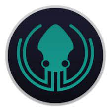

# Delani Studio 
## Description
This is a project that details what Delani Studio does and their works. Additionally, it allows users to send messages and receive email confirmations n receival of the messages by the company.
## Project live site
  This is the live .[ Click for the demo](https://leondante-ctrl.github.io/delanitime)

## Setup instructions
* Clone the program from [Online repo](https://leondante-ctrl.github.io/delanitime)
* Click on the green button to clone or download

## Technologies Used
* HTML
* CSS
* Bootsrap
* JQuery
* Javascript

## Support and contact details
contact me @ maxgamerdu@gmail.com
### License
The project is under [MIT license](https://github.com/LeonDante-ctrl/delanitime/blob/master/LICENSE)
Copyright &copy; 2021. All rights are most definately reserved
  